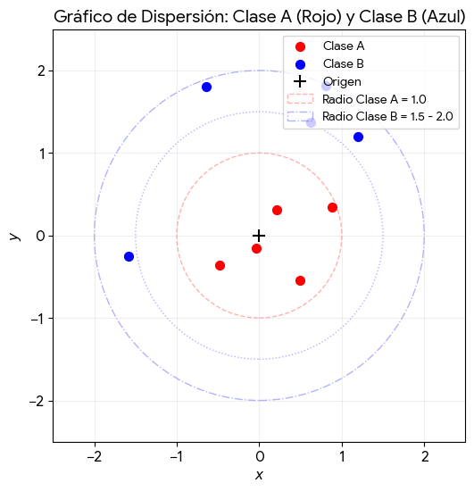
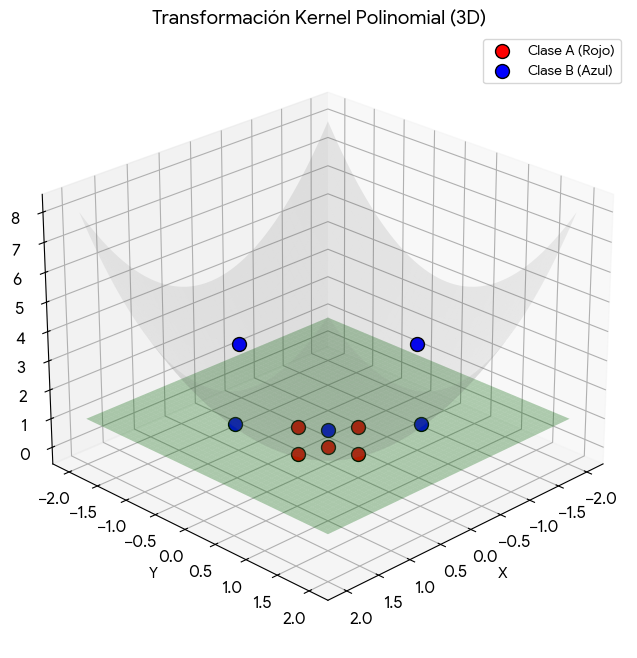

# para estos puntos:

Clase A (rojo 🔴): puntos dentro de un círculo de radio 1 (centro en el origen)

* (0, 0)
* (0.5, 0)
* (0, 0.5)
* (-0.5, 0)
* (0, -0.5)

Clase B (azul 🔵): puntos en una corona entre radio 1.5 y radio 2

* (1.5, 0)
* (0, 1.5)
* (-1.5, 0)
* (0, -1.5)
* (1.2, 1.2)

## gráfica

Como ve no son línealmente separables. Pero  en lugar de los valores originales ($x1, x2$), usemos la siguiente funcion donde como tercera características tomaremos el radio del punto $x1,x2$ o sea su distancia al origen = $x_1^2 + x_2^2$

$$ \phi(\mathbf{x}) = (x_1,\ x_2,\ x_1^2 + x_2^2)$$

Ahora nos quedan los siguientes puntos transformados a 3D

Clase A (rojos) — radio ≤ 1:
* (0, 0) → (0, 0, 0)
* (0.5, 0) → (0.5, 0, 0.25)
* (0, 0.5) → (0, 0.5, 0.25)
* (-0.5, 0) → (-0.5, 0, 0.25)
* (0, -0.5) → (0, -0.5, 0.25)

Clase B (azules) — radio entre 1.5 y 2:
* (1.5, 0) → (1.5, 0, 2.25)
* (0, 1.5) → (0, 1.5, 2.25)
* (-1.5, 0) → (-1.5, 0, 2.25)
* (0, -1.5) → (0, -1.5, 2.25)
* (1.2, 1.2) → (1.2, 1.2, 2.88)

Truco del kernel

Este procedimiento se conoce en aprendizaje automático como el truco del kernel (Kernel Trick), utilizando específicamente un kernel polinomial de segundo grado. Al elevar los puntos bidimensionales a un espacio tridimensional sobre la superficie de un paraboloide, los datos que antes requerían una frontera circular ahora se vuelven linealmente separables.Un hiperplano horizontal situado en cualquier punto intermedio de la altura (por ejemplo, en el plano \(z = 1\)) puede dividir perfectamente ambas clases de forma lineal.ConclusiónEl gráfico en 3D ilustra cómo la Clase A permanece prácticamente plana en el fondo, mientras que la Clase B sube drásticamente por las paredes de la función, facilitando su clasificación geométrica.

Con un plano en el eje Z en 1.25 tenemos la separación lineal.

Kernel?

En aprendizaje automático (Machine Learning), esta transformación recibe este nombre por dos razones principales:
* Origen matemático: En álgebra lineal y ecuaciones integrales, un kernel es una función que define la relación o "peso" entre dos puntos. Actúa como el núcleo de una operación de transformación.
* Medida de similitud: El kernel toma dos vectores de entrada y calcula su similitud en un espacio de mayor dimensión, todo esto sin necesidad de calcular explícitamente las coordenadas de ese nuevo espacio (lo que se conoce como el truco del kernel).

En este ejemplo, la función que calcula la altura $(z = x^2 + y^2)$ es la esencia (el núcleo) que permite al algoritmo ver una separación lineal donde antes solo había círculos concéntricos.

## Actividad

Resuelve este ejercicio usando el perceptron

## Entregable
* código del resultado cargado en GitHub
