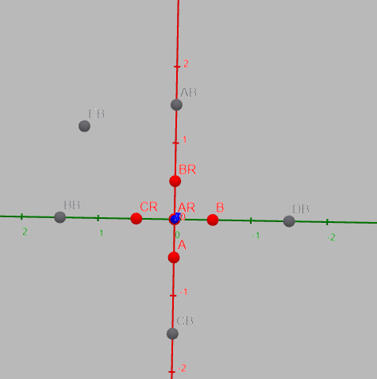
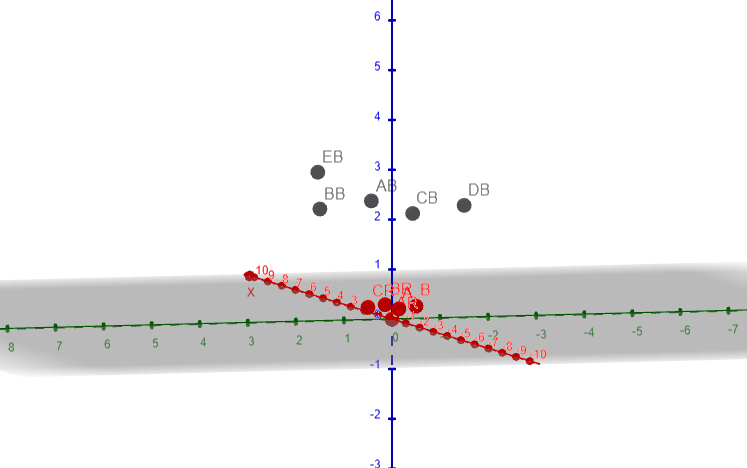

# Ingeniería de características

Feature Engineering es el arte de preparar los datos para que un modelo de Machine Learning pueda entenderlos y aprender de ellos de la mejor manera posible.

Los modelos matemáticos solo entienden números.

Un buen feature engineering reduce la necesidad de modelos ultracomplejos. Muchas veces, un modelo simple con excelentes features le gana a un modelo complejo con features mal hechos.

>Nota: No es lo mismo que la limpieza de datos (quitar valores nulos o duplicados). La limpieza es el mínimo; el feature engineering es el plus.

las tareas de un "ingeniero de features":

1. Creación de nuevas features (Transformación)
A partir de los datos crudos, inventas otros más útiles.

Ejemplo: Si tienes "Fecha de nacimiento" y "Fecha de compra", no le des eso al modelo. Créale la feature "Edad" (Fecha compra - Fecha nacimiento). Es mucho más útil.

Ejemplo: Si tienes "Ancho" y "Largo", crea el "Área" (Ancho x Largo).

2. Escalado y Normalización
Los modelos (como regresión logística o SVM) son sensibles a las escalas. Si una feature va de 0 a 1 y otra de 0 a 1.000.000, la grande aplastará a la pequeña. Soluciones:

Estandarización: Convertir los datos para que tengan media 0 y desviación 1.

Min-Max: Comprimir todos los datos entre 0 y 1.

3. Manejo de Categóricas (Codificación)
El modelo no entiende "Rojo", "Azul" o "Verde". Hay que pasarlo a números:

One-Hot Encoding: Crear columnas falsas (¿Es rojo? Sí/No).

Label Encoding: Asignar números (Rojo=1, Azul=2), pero ¡cuidado! Esto implica un orden que quizás no existe.

4. Imputación de valores faltantes
No puedes tener huecos. Decide si los llenas con la media, la mediana, el valor más frecuente, o si creas una categoría especial llamada "Desconocido".

5. Extracción de Fechas y Texto

De una fecha puedes sacar: Día de la semana, fin de semana o no, mes del año, hora del día (mañana/tarde/noche).

De un texto, puedes contar palabras, detectar si contiene cierta palabra clave, o usar técnicas como TF-IDF.

La Selección de Features

No todas las características sirven. Tener demasiadas (maldición de la dimensionalidad) hace que el modelo aprenda ruido en vez de patrones.

Filter methods: Miras la correlación estadística de cada feature con el resultado y te quedas con las que más se relacionan.

Wrapper methods: Pruebas combinaciones de features y ves cuál da mejor resultado (ej. Forward Selection).

Embedded methods: El propio modelo (como Lasso o Árboles de Decisión) te dice qué features son más importantes y descarta las demás.

 El conocimiento del negocio (Dominio)
La mejor ingeniería de features no sale de un libro, sale de entender el problema.

Si estás prediciendo precios de casas, sabes que el número de baños importa más que el color de la fachada.

Si predices fraude bancario, sabes que comprar en horario nocturno es más sospechoso que en horario laboral.

Tip de experto: Siéntate con el experto en el negocio (el que lleva 20 años en ventas, finanzas o medicina) y pregúntale: "¿Qué 5 cosas miras tú para tomar esta decisión?". Esas 5 cosas son tus nuevas features.

## Ejemplo crear nuevas caractrísticas

### para estos puntos:

Clase A (rojo 🔴): puntos dentro de un círculo de radio 1 (centro en el origen)

* (0, 0)
* (0.5, 0)
* (0, 0.5)
* (-0.5, 0)
* (0, -0.5)

Clase B (azul 🔵): puntos en una corona entre radio 1.5 y radio 2

* (1.5, 0)
* (0, 1.5)
* (-1.5, 0)
* (0, -1.5)
* (1.2, 1.2)

### gráfica

Como ve no son línealmente separables. Pero  en lugar de los valores originales ($x1, x2$), usemos la siguiente funcion donde como tercera características tomaremos el radio del punto $x1,x2$ o sea su distancia al origen = $x_1^2 + x_2^2$

$$ \phi(\mathbf{x}) = (x_1,\ x_2,\ x_1^2 + x_2^2)$$

Ahora nos quedan los siguientes puntos transformados a 3D

Clase A (rojos) — radio ≤ 1:
* (0, 0) → (0, 0, 0)
* (0.5, 0) → (0.5, 0, 0.25)
* (0, 0.5) → (0, 0.5, 0.25)
* (-0.5, 0) → (-0.5, 0, 0.25)
* (0, -0.5) → (0, -0.5, 0.25)

Clase B (azules) — radio entre 1.5 y 2:
* (1.5, 0) → (1.5, 0, 2.25)
* (0, 1.5) → (0, 1.5, 2.25)
* (-1.5, 0) → (-1.5, 0, 2.25)
* (0, -1.5) → (0, -1.5, 2.25)
* (1.2, 1.2) → (1.2, 1.2, 2.88)

### Truco del kernel

Este procedimiento se conoce en aprendizaje automático como el truco del kernel (Kernel Trick), utilizando específicamente un kernel polinomial de segundo grado. Al elevar los puntos bidimensionales a un espacio tridimensional sobre la superficie de un paraboloide, los datos que antes requerían una frontera circular ahora se vuelven linealmente separables.Un hiperplano horizontal situado en cualquier punto intermedio de la altura (por ejemplo, en el plano \(z = 1\)) puede dividir perfectamente ambas clases de forma lineal.ConclusiónEl gráfico en 3D ilustra cómo la Clase A permanece prácticamente plana en el fondo, mientras que la Clase B sube drásticamente por las paredes de la función, facilitando su clasificación geométrica.

Con un plano en el eje Z en 1.25 tenemos la separación lineal.

Kernel?

En aprendizaje automático (Machine Learning), esta transformación recibe este nombre por dos razones principales:
* Origen matemático: En álgebra lineal y ecuaciones integrales, un kernel es una función que define la relación o "peso" entre dos puntos. Actúa como el núcleo de una operación de transformación.
* Medida de similitud: El kernel toma dos vectores de entrada y calcula su similitud en un espacio de mayor dimensión, todo esto sin necesidad de calcular explícitamente las coordenadas de ese nuevo espacio (lo que se conoce como el truco del kernel).

En este ejemplo, la función que calcula la altura $(z = x^2 + y^2)$ es la esencia (el núcleo) que permite al algoritmo ver una separación lineal donde antes solo había círculos concéntricos.

### Actividad

1. Visualiza la gráfica antes y despues de aplicar la función kernel en Geogebra.

para los puntos rojos en 3D:
* AR = Punto( {0,    0,   0} )
* BR = Punto( {0.5,  0,   0} )
* CR = Punto( {0,    0.5, 0} )
* DR = Punto( {-0.5, 0,   0} )
* ER = Punto( {0,   -0.5, 0} )
* SetColor( AR, 1, 0, 0)
* SetColor( BR, 1, 0, 0)
* SetColor( CR, 1, 0, 0)
* SetColor( DR, 1, 0, 0)
* SetColor( ER, 1, 0, 0)

para los puntos azules en 3D:
* AB = Punto( {1.5,  0,   0} )
* BB = Punto( {0,    1.5, 0} )
* CB = Punto( {-1.5, 0,   0} )
* DB = Punto( {0,   -1.5, 0} )
* EB = Punto( {1.2, 1.2,  0} )
* SetColor( AB, 0, 0, 1)
* SetColor( BB, 0, 0, 1)
* SetColor( CB, 0, 0, 1)
* SetColor( DB, 0, 0, 1)
* SetColor( EB, 0, 0, 1)

**Ahora llevemoslo a 3D**
$$ Z = (\ x_1^2 + x_2^2)$$

para los puntos rojos en 3D:
* AR = Punto( {0,    0,   0} )
* BR = Punto( {0.5,  0,   0.25} )
* CR = Punto( {0,    0.5, 0.25} )
* DR = Punto( {-0.5, 0,   0.25} )
* ER = Punto( {0,   -0.5, 0.25} )
* SetColor( AR, 1, 0, 0)
* SetColor( BR, 1, 0, 0)
* SetColor( CR, 1, 0, 0)
* SetColor( DR, 1, 0, 0)
* SetColor( ER, 1, 0, 0)

para los puntos azules en 3D:
* AB = Punto( {1.5,  0,   2.25} )
* BB = Punto( {0,    1.5, 2.25} )
* CB = Punto( {-1.5, 0,   2.25} )
* DB = Punto( {0,   -1.5, 2.25} )
* EB = Punto( {1.2, 1.2,  2.88} )
* SetColor( AB, 0, 0, 1)
* SetColor( BB, 0, 0, 1)
* SetColor( CB, 0, 0, 1)
* SetColor( DB, 0, 0, 1)
* SetColor( EB, 0, 0, 1)

2. Resuelve este ejercicio usando el perceptron

### Entregable
* código del resultado cargado en GitHub

