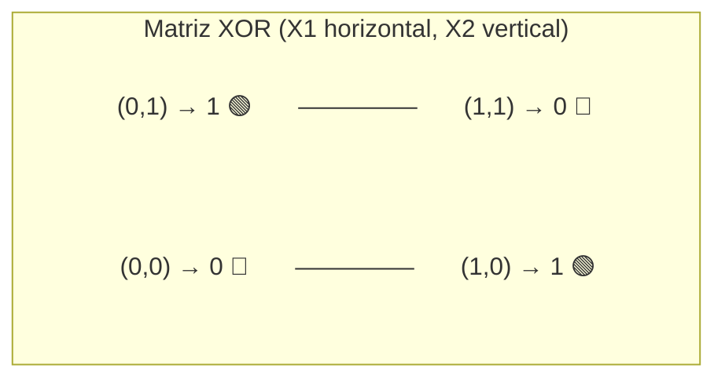
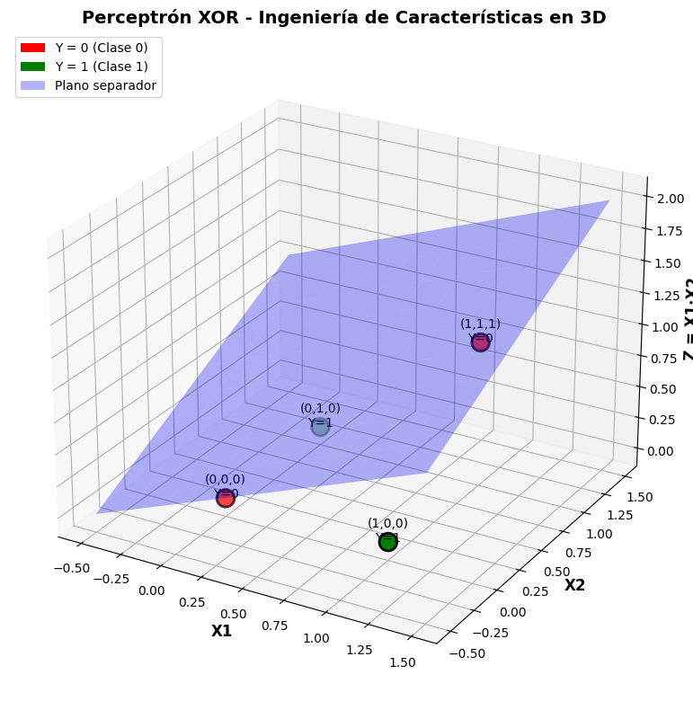
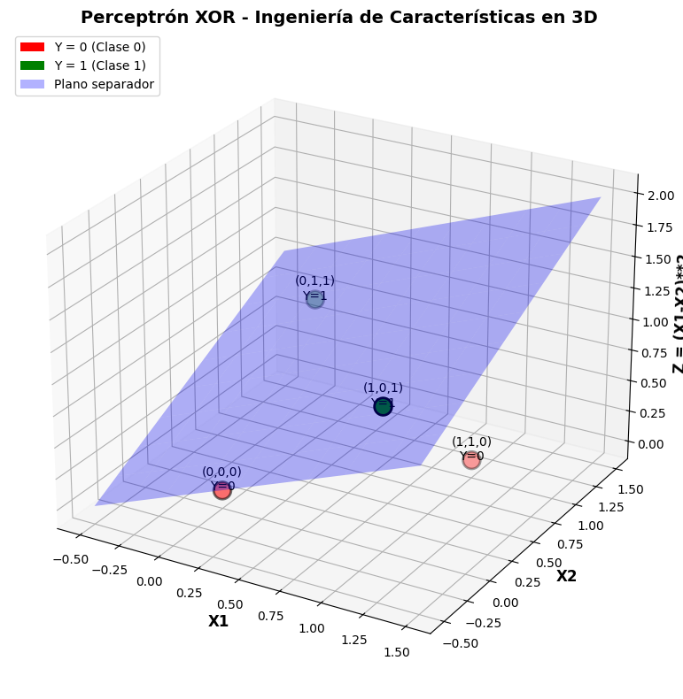

# Feature igeniering

## Caso de estudio - Xor

¿Se puede usar el perceptrón para clasificar las salidas del XOR?

Gráfica de las salidas de XOR


La respuesta es `NO` por que no son linealmente separables, en la grafica anterior es imposible trazar una recta que separa los puntos verdes de los rojos, sin embargo podemos hacerlo apoyandonos del `feature ingeniering`.


La ingeniería de características (o Feature Engineering) consiste en crear nuevas variables de entrada a partir de las originales, para que un modelo lineal (como el perceptrón) pueda trazar una línea recta (o hiperplano) en este nuevo espacio dimensional y así resolver el problema.


Como sabemos el **XOR** es **No** lineal con sus datos originales que son solo 2 características: X1 y X2.

La tabla XOR con entradas (X1, X2) y (Salida (Y)) es:

|X1	|X2	|Y|
|---|---|--|
|0	|0	|0|
|0	|1	|1|
|1	|0	|1|
|1	|1	|0|

En la grafica 2D (con variables: X1, X2) que se muestra al inicio, verás que los 1 están en esquinas opuestas y los 0 en las otras dos esquinas. Ninguna línea recta puede separarlos. Un perceptrón simple falla aquí.

## Aplicar Ingeniería de Características

Para que el perceptrón (que nos da una línea recta o plano) pueda separar el XOR, vamos a elevar la dimensión de los datos. Crearemos una tercera característica (Z) para elevar la dimension del problema de 2d a 3d, probemos agregando la tercera variable como el producto de las dos originales.

La nueva característica: Z = X1 * X2

Ahora nuestros datos de entrenamiento ya no tienen 2 columnas, sino 3 columnas (X1, X2, Z):


|X1	|X2	|Z (X1·X2)	|Salida (Y)|
|---|---|-----------|----------|
|0	|0	|0	|0|
|0	|1	|0	|1|
|1	|0	|0	|1|
|1	|1	|1	|0|



Ahora viene la magia:
El perceptrón aprenderá pesos: W1, W2, W3 y un sesgo (W0). La fórmula será:

Salida = Paso( W0 + W1·X1 + W2·X2 + W3·Z )

El algoritmo encontrará (por ejemplo) estos pesos: W0 = 0.5, W1 = -1, W2 = -1, W3 = 2.
Si sustituyes los valores:

Para (0,0): 0.5 + 0 + 0 + 0 = 0.5 → 1 (Error, esperábamos 0. Ajustamos el sesgo a -0.5)

Probamos con sesgo = -1.5:

(0,0): -1.5 → 0 (Bien)

(0,1): -1.5 -1 = -2.5 → 0 (Error, esperábamos 1. Aumentamos W2)

Finalmente, el perceptrón aprende algo como: W0 = -0.5, W1 = 1, W2 = 1, W3 = -2.

Comprobamos:

(0,0): -0.5 → 0 (Bien)

(0,1): -0.5 + 0 + 1 + 0 = 0.5 → 1 (Bien)

(1,0): -0.5 + 1 + 0 + 0 = 0.5 → 1 (Bien)

(1,1): -0.5 + 1 + 1 - 2 = -0.5 → 0 (Bien)

¡Lo logró! En el nuevo espacio 3D, el perceptrón trazó un plano (no una línea) que separa perfectamente los puntos.

## Otras funciones que podemos usar

Observa que tambien podemos usar:
```pyhton
Z=(X1 - X2) ** 2
```



## Visualizar gráfica para encontrar plano de separación

Geogebra es una herramienta matemática muy completa. Puedes graficar funciones discretas definiéndolas por partes o usando la herramienta de punto para marcar los valores que te interesan. La función Function[{<Lista de Números>}] te permite definir una función a partir de una lista de valores, donde los primeros dos números definen el inicio y el fin del dominio, y los siguientes son los valores de y.

## Actividad 

**Ejercicio 1:** Entra a Geogebra:

1. [Geogebra](https://www.geogebra.org/calculator)

2. Elije calculadora 3D

Para las salidas del or exclusivo (XOR)
|X1	|X2	|Y|
|---|---|--|
|0	|0	|0|
|0	|1	|1|
|1	|0	|1|
|1	|1	|0|

Pongamos la función XOR en 3D pero pensemos que la función sigue en 2D poniendo 0 en la coordenada Z. 

|X1	|X2	|Z  |Salida (Y)|
|---|---|-----------|----------|
|0	|0	|0	|0|
|0	|1	|0	|1|
|1	|0	|0	|1|
|1	|1	|0	|0|


Grafique los puntos poniendo en geogebra:
A = Punto( {0, 0, 0} )
B = Punto( {0, 1, 0} )
C = Punto( {1, 0, 0} )
D = Punto( {1, 1, 0} )
SetColor( A, 1, 0, 0)
SetColor( D, 1, 0, 0)

Rote la gráfica (arrastrando los ejes con el ratón) y verá que no puede encontrar la forma de poner un plano de separación de los puntos rojos y grises.
Borre los puntos A, B, C, D

3. Ahora usemos en Z la función kernel Z = X1 * X2

|X1	|X2	|Z	|Salida (Y)|
|---|---|-----------|----------|
|0	|0	|0	|0|
|0	|1	|0	|1|
|1	|0	|0	|1|
|1	|1	|1	|0|

Grafique los puntos poniendo en Geogebra:
A = Punto( {0, 0, 0} )
B = Punto( {0, 1, 0} )
C = Punto( {1, 0, 0} )
D = Punto( {1, 1, 1} )
SetColor( A, 1, 0, 0)
SetColor( D, 1, 0, 0)

Rote la gráfica (arrastrando los ejes con el ratón) y verá que ahora **SI** puede encontrar la forma de poner un plano de separación entre los puntos rojos y grises.

Borre los puntos A, B, C, D


4. Repita ahora para el kernel : Z = X1 * X2

pon los puntos:

A = Punto( {0, 0, 0} )
B = Punto( {0, 1, 0} )
C = Punto( {1, 0, 0} )
D = Punto( {1, 1, 1} )
SetColor( A, 1, 0, 0)
SetColor( D, 1, 0, 0)


Roté la figura y verá que puede encontrar un plano de sepración entre puntos rojos y grises.

**Ejercicio 2:** Repite pero ahora use la función kernel Z=(x1-x2)**2

|X1	|X2	|Z (X1·X2)	|Salida (Y)|
|---|---|-----------|----------|
|0	|0	|0	|0|
|0	|1	|1	|1|
|1	|0	|1	|1|
|1	|1	|0	|0|

ponga los puntos:

A = Punto( {0, 0, 0} )
B = Punto( {0, 1, 1} )
C = Punto( {1, 0, 1} )
D = Punto( {1, 1, 0} )
SetColor( A, 1, 0, 0)
SetColor( D, 1, 0, 0)

Roté los ejes y verá que púede encontrar un plano de separación