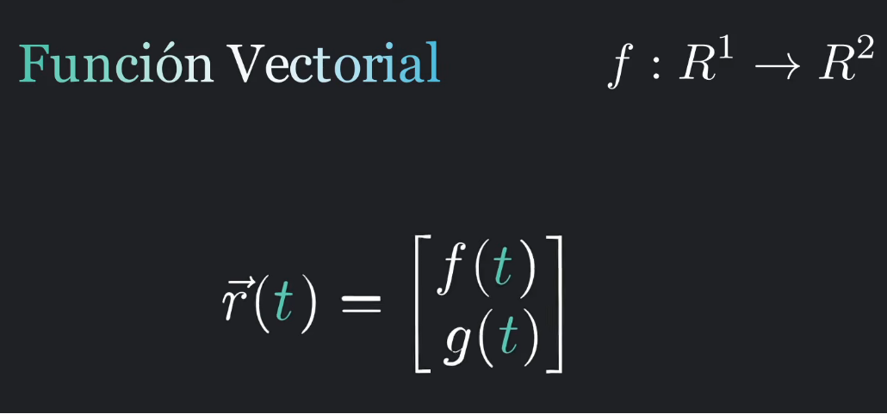
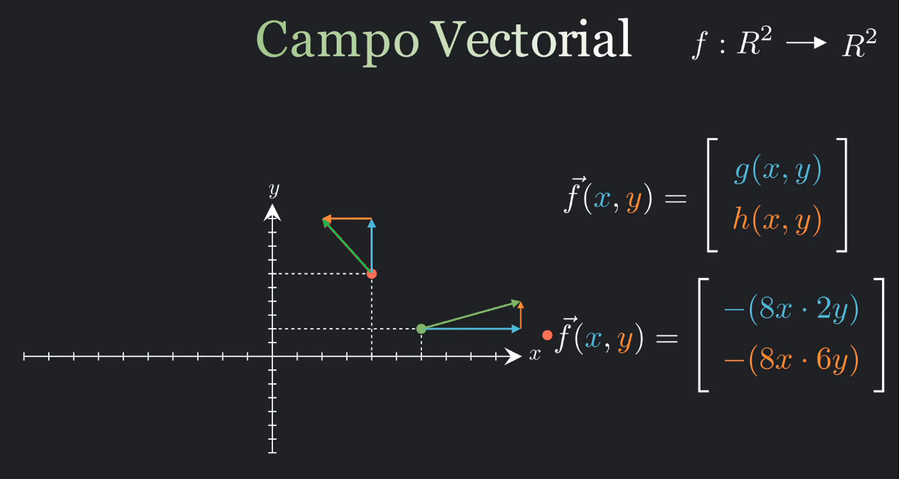
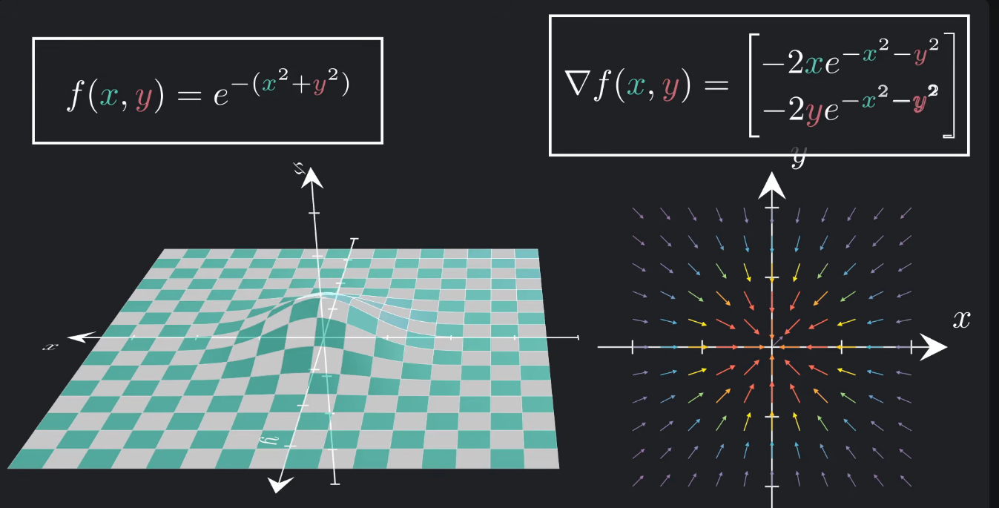
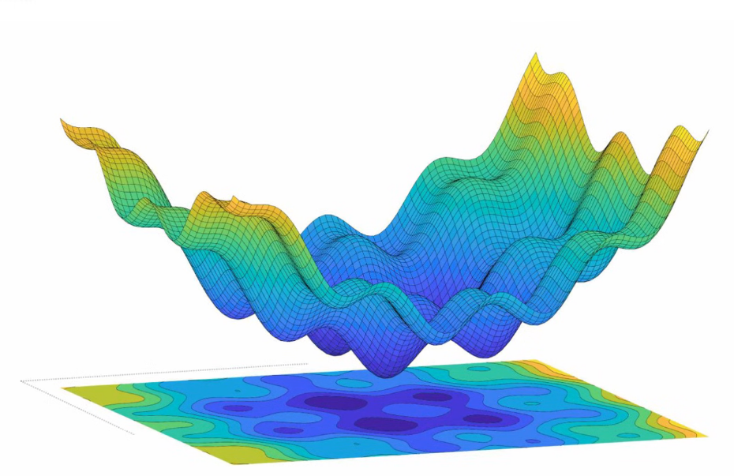

# Gradiente

## Función vectorial

Una función vectorial es una función cuyo dominio es un conjunto de números reales (o un subconjunto de ellos) y cuyo codominio es un conjunto de vectores. En términos simples: es una función que toma un número y devuelve un vector.

*fig 3: función vectorial / representación matricial*

Como un ejemplo particular funciones como $f:R^2 → R^2$ es una función vectorial en el sentido amplio (su salida es un vector), pero no es una función vectorial de una variable. Es, más precisamente, un campo vectorial o una función vectorial de variable vectorial.

## Campo vectorial

Un campo vectorial es una función matemática que asigna un vector a cada punto de un espacio. En términos simples: es como si en cada punto del espacio pusieras una flecha que indica una dirección, un sentido y una magnitud.

*fig 3: campo vectorial*

## Gradiente de una función

El gradiente de una función en un punto dado, es un vector que indica la dirección de máximo crecimiento de la función, cuya magnitud es la máxima tasa de cambio, y se obtiene calculando las derivadas parciales.

Si graficamos el gradiente en cada punto, obtenemos un campo vectorial como:

*fig 3: si graficamos el gradiente tenemos un campo*

>Observe que el gradiente de una función apunta en la dirección de crecimiento de la función.

## Función de coste.

La función de coste mide qué tan mal está prediciendo tu modelo. Es un número que te dice el error total.

* Coste alto → el modelo se equivoca mucho.
* Coste bajo → el modelo predice bien.
* Entrenar = buscar los parámetros que hacen que ese número sea lo más pequeño posible.

Un ejemplo típico de funcion de coste es el error cuadrático medio (MSE): promedio de las diferencias al cuadrado entre lo que predice el modelo y lo que realmente pasa.

*fig 4:ejemplo de una función de coste*

## Ejemplo

Suponga que tenemos la siguiente función de coste.

*fig 5:ejemplo de una función de coste*

Ya sabemos que el grafiente nos da la dirección de crecimiento de la función, para un algoritmo de aprendizaje donde queremos minimizar la funcióbn de coste, lo que debemos hacer es iniciar en un punto al azar (por ejemplo el punto rojo), calcular el gradiente y movernos en dirección opuesta para buscar un mínimo de la función.