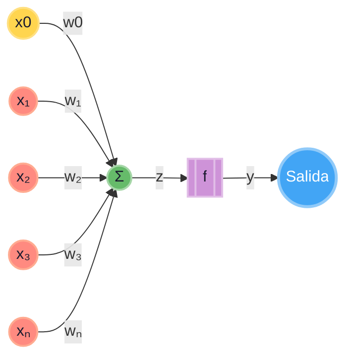

# Perceptrón simple (con el sesgo incluido como $x_0w_0$)

jflores

## perceptron


## 1. Arquitectura básica.

Para simplificar las matemáticas y la implementación, añadimos una entrada fija adicional $x_0 = 1$. Su peso correspondiente será $w_0$, que actuará como el **sesgo** (*bias*).

De esta forma, el perceptrón recibe **$n+1$ entradas**:

- $x_0 = 1$ (entrada constante)
- $x_1, x_2, \dots, x_n$ (entradas de los datos)

Y sus pesos correspondientes:

- $w_0 = b$ (el sesgo)
- $w_1, w_2, \dots, w_n$ (pesos de las características)

La suma ponderada (potencial de activación) se calcula como:

$$
z = \sum_{i=0}^{n} w_i x_i = w_0 \cdot 1 + \sum_{i=1}^{n} w_i x_i = b + \sum_{i=1}^{n} w_i x_i
$$

Luego, aplicamos la función de activación **escalón** (o *Heaviside*):

$
\hat{y} = 
\begin{cases} 
1 & \text{si } z \geq 0 \\
0 & \text{si } z < 0
\end{cases}
$

---

## 2. El error

Para ajustar los pesos, primero calculamos el **error** entre la salida deseada la etiqueta real ($y$) y la salida obtenida $(\hat{y}$):

$
e = y - \hat{y}
$

Los posibles valores del error son:

- **$e = 0$** → La predicción fue correcta.
- **$e = +1$** → $y = 1$ y $\hat{y} = 0$ (Falso negativo, la neurona no se activó cuando debía).
- **$e = -1$** → $y = 0$ y $\hat{y} = 1$ (Falso positivo, la neurona se activó cuando no debía).

---

## 3. La regla de actualización de pesos (Regla Delta unificada)

Ahora, **la misma fórmula** se aplica a **todos** los pesos, incluyendo el sesgo:

$$
\Delta w_i = \eta \cdot e \cdot x_i
$$

$$
w_i^{\text{nuevo}} = w_i^{\text{viejo}} + \Delta w_i
$$

Donde:
- **$\eta$** (eta) es la **tasa de aprendizaje**.
- **$e$** es el error calculado.
- **$x_i$** es el valor de la entrada i-ésima.

Observa que para $i = 0$, como $x_0 = 1$, la actualización del sesgo es:

$$
\Delta w_0 = \eta \cdot e \cdot 1 = \eta \cdot e
$$
$$
b^{\text{nuevo}} = b^{\text{viejo}} + \eta \cdot e
$$

Que es exactamente la misma regla que teníamos antes, pero ahora forma parte natural de la misma ecuación.

---

## 4. Lógica intuitiva del ajuste (caso por caso)

Vamos a ver qué hace esta fórmula en cada situación (suponiendo $\eta > 0$):

| Caso | $y$ | $\hat{y}$ | $e$ | Entrada $x_i$ | Que queremos sobre $w_i$ |
| :--- | :--- | :--- | :--- | :--- | :--- |
| **Acierto** | 1 | 1 | 0 | Cualquiera | **No se modifique** ($\Delta w_i = 0$)<br> $e*x_i$ es cero  |
| **Acierto** | 0 | 0 | 0 | Cualquiera | **No se modifique** ($\Delta w_i= 0$)<br> $e*x_i$ es cero  |
| **Falso Negativo** | 1 | 0 | **+1** | $x_i$ positiva (+) | **Aumente** el peso ($\Delta w_i > 0$) (para que la próxima vez sume más y se active)<br> $e*x_i$ es positivo |
| **Falso Negativo** | 1 | 0 | **+1** | $x_i$ negativa (-) | **Disminuya** el peso ($\Delta w_i< 0$) (para que no reste tanto y se active)<br> $e*x_i$ es negativo |
| **Falso Positivo** | 0 | 1 | **-1** | $x_i$ positiva (+) | **Disminuya** el peso ($\Delta w_i < 0$) (para que la próxima vez sume menos y no se active)<br> $e*x_i$ es negativo |
| **Falso Positivo** | 0 | 1 | **-1** | $x_i$ negativa (-) | **Aumente** el peso ($\Delta w_i > 0$)  (para que reste más y no se active)<br> $e*x_i$ es positivo |

> **En resumen:** Al incluir $x_0 = 1$, el sesgo se comporta exactamente igual que cualquier otro peso, pero como su entrada siempre es positiva, su ajuste solo depende del signo del error.

---

## 5. Algoritmo de entrenamiento completo (paso a paso)

1. Inicializar **todos** los pesos $w_0, w_1, \dots, w_n$ con valores pequeños aleatorios (ej. entre -0.5 y 0.5). Recuerda que $w_0$ es el sesgo.
2. Para cada muestra de entrenamiento $(x, y)$:
   - Asegurarte de que el vector de entrada incluya $x_0 = 1$: $x = [1, x_1, x_2, \dots, x_n]$.
   - Calcular la salida $\hat{y}$ (aplicar el escalón a $z = \sum w_i x_i$).
   - Calcular el error $e = y - \hat{y}$.
   - **Actualizar TODOS los pesos**: $w_i = w_i + \eta \cdot e \cdot x_i$ para $i = 0, 1, \dots, n$.
3. Repetir el paso 2 durante varias **épocas** hasta que todos los ejemplos se clasifiquen correctamente (error 0) o se alcance un número máximo de iteraciones.

## 6. Puntos clave y limitaciones

- **Convergencia**: El teorema de convergencia del perceptrón garantiza que **si los datos son linealmente separables**, el algoritmo encontrará una solución en un número finito de pasos.
- **Tasa de aprendizaje**: Si $\eta$ es muy grande, los pesos oscilarán y no convergerán. Si es muy pequeño, tardará mucho en aprender. Un valor típico es $\eta = 0.1$ o $0.01$.
- **Limitación**: Si los datos **no son linealmente separables** (ej. la función XOR), el perceptrón simple **nunca convergerá** y los pesos seguirán saltando sin encontrar una solución.


## Ejemplo en python
```python
import numpy as np

# --- Configuración del perceptrón ---
eta = 0.1                     # Tasa de aprendizaje
max_epochs = 10               # Máximo de épocas

# --- Datos de entrenamiento (puerta AND) ---
X_train = np.array([
    [0, 0],
    [0, 1],
    [1, 0],
    [1, 1]
])
y_train = np.array([0, 0, 0, 1])

# Número de características (sin contar el sesgo)
n_features = X_train.shape[1]

# 1. Inicializar TODOS los pesos (w_0, w_1, ..., w_n) con valores pequeños aleatorios entre -0.5 y 0.5.
#    El índice 0 es el sesgo (w_0), los demás son pesos de las características.
weights = np.random.uniform(-0.5, 0.5, size=n_features + 1)

# Función de activación escalón
def step_activation(z):
    return 1 if z >= 0 else 0

# Función para predecir una sola muestra (con sesgo incluido)
# esta funci´´on recibe algo como [0, 1] o [1, 1]
def predict(x):
    # Agregar el sesgo: [1, x1, x2, ...]
    # inserta 1 en la posición 0 del vector x, 
    # Si x = [x1, x2], el resultado es [1, x1, x2]
    x_with_bias = np.insert(x, 0, 1) 
    # Calcula el producto punto entre el vector de pesos y el vector de entrada con sesgo. Es decir, la suma ponderada:
    # z=w_0⋅1+w_1⋅x1+w_2⋅x_2
    z = np.dot(weights, x_with_bias)
    return step_activation(z)

# --- Entrenamiento ---
for epoch in range(max_epochs):
    total_errors = 0

    # 2. Para cada muestra de entrenamiento
    # zip(X_train, y_train) empareja elmento a lemento los 2 arrays
    # X_train matriz de entradas (4 filas × 2 columnas).
    # y_train Vector de salidas esperadas (4 valores: 0, 0, 0, 1).
    # xi Variable que guardará cada muestra de entrada (un vector como [0, 1]).
    # target Variable que guardará la etiqueta correcta correspondiente a esa muestra.
    for xi, target in zip(X_train, y_train):
        # 2a. Agregar Bias, x_0 = 1
        x_with_bias = np.insert(xi, 0, 1)

        # 2b. Calcular la salida (suma ponderada + escalón)
        # suponga pesos weigths = [0.2, -0.4, 0.3]
        # y x_with_bias = [1, 1, 1]
        # entonces: z = np.dot(weights, x_with_bias)
        # equivale a:
        # z = (0.2 * 1) + (-0.4 * 1) + (0.3 * 1) = 0.2 - 0.4 + 0.3 = 0.1
        z = np.dot(weights, x_with_bias)
        y_hat = step_activation(z)

        # 2c. Calcular el error
        error = target - y_hat

        # 2d. Actualizar TODOS los pesos: w_i = w_i + eta * error * x_i
        weights = weights + eta * error * x_with_bias

        # Acumular el error absoluto para saber si hay fallos
        total_errors += abs(error)

    # Si el error total es 0, todos los ejemplos se clasificaron correctamente
    if total_errors == 0:
        print(f"Convergencia alcanzada en la época {epoch + 1}")
        break

print(f"Entrenamiento finalizado. Pesos finales: {weights}")

# --- Prueba de predicciones ---
print("\n--- Predicciones finales ---")
for xi in X_train:
    pred = predict(xi)
    print(f"Entrada: {xi} -> Predicción: {pred}")
```

Ejemplo en JS
```js
class Perceptron {
  constructor(nEntradas, tasaAprendizaje = 0.1) {
    this.pesos = new Array(nEntradas).fill(0);
    this.bias = 0;
    this.tasaAprendizaje = tasaAprendizaje;
  }

  activacion(z) {
    return z >= 0 ? 1 : 0;
  }

  predecir(x) {
    const z = x.reduce((suma, xi, i) => suma + xi * this.pesos[i], 0) + this.bias;
    return this.activacion(z);
  }

  entrenar(X, y, epocas = 10) {
    for (let e = 0; e < epocas; e++) {
      for (let i = 0; i < X.length; i++) {
        const xi = X[i];
        const yi = y[i];
        const prediccion = this.predecir(xi);
        const error = yi - prediccion;

        // Actualizamos pesos y bias
        this.pesos = this.pesos.map((w, j) => w + this.tasaAprendizaje * error * xi[j]);
        this.bias += this.tasaAprendizaje * error;
      }
    }
  }
}

// Datos de entrenamiento: función lógica AND
const X = [[0,0], [0,1], [1,0], [1,1]];
const y = [0, 0, 0, 1];

const p = new Perceptron(2);
p.entrenar(X, y, 10);

X.forEach(xi => {
  console.log(`Entrada: [${xi}] -> Predicción: ${p.predecir(xi)}`);
});

console.log("Pesos finales:", p.pesos);
console.log("Bias final:", p.bias);
```
---


# La regla delta

## perceptron simple


$$\Delta w_i = \eta \cdot (y- \hat{y}) \cdot x_i$$
Donde
* $\Delta w_i$ = cambio en el peso $w_i$
* $\eta$ = tasa de aprendizaje
* $y$ = salida deseada (0,1)
* $\hat{y}$ = salida predicha
* $x_i$ = entrada i

Problema: solo funciona para datos linealmente separables y los cambios son bruscos (no graduales).

