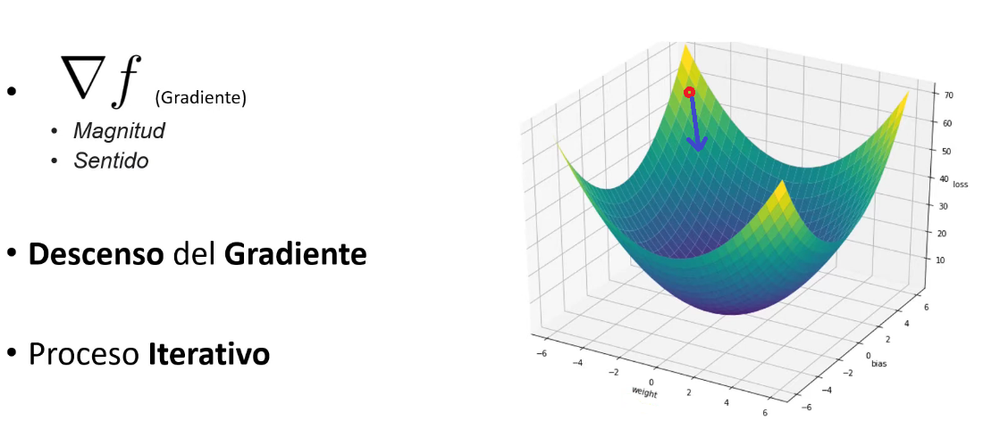

## Regla delta generalizada

La regla delta generalizada es la extensión de la regla delta original (usada en el perceptrón simple) para redes neuronales con múltiples capas y funciones de activación no lineales. Es, en esencia, el algoritmo de retropropagación del error (backpropagation).

Regla delta original (Widrow-Hoff, 1960): se aplica a un perceptrón de una sola capa con activación lineal. Ajusta los pesos según:
$$\Delta w_i = \eta (t - y) x_i$$
*<div align="center">formula 0 regla delta (Widrow-Hoff)</div>*

donde $t$ es la salida deseada, $y$ la salida obtenida, $η$ la tasa de aprendizaje y $x_i$ la entrada $i$.

La *Regla delta generalizada* extiende esta idea a redes multicapa. El problema es que en las capas ocultas no conocemos la "salida deseada", por lo que no podemos calcular directamente el error. La solución es propagar el error hacia atrás desde la salida hasta las capas ocultas, usando la regla de la cadena del cálculo diferencial.

La regla delta generaliza del aprendizaje usa el error cuadratico medio y permite ajustes proporcionales al error, lo que la hace mas suave y aplicable a funciones continuas.

1. Función de activación continua. En lugar de la función escalón. Se usa una función diferenciable como *sigmoid*e o *tangente hiperbólica*. **Usemos sigmoide**:

$$f(z) = \frac{1}{1+e^{-z}}$$ 
*<div align="center">formula 1 función sigmide</div>*

Esto permite calcular derivadas y aplicar gradiente. 

Para una función escalar $f(x,y,z)$, el gradiente es el vector de sus derivadas parciales:
$$\nabla f = \left( \frac{\partial f}{\partial x}, \frac{\partial f}{\partial y}, \frac{\partial f}{\partial z} \right)$$
*<div align="center">formula 2 gradiente de la función</div>*


El gradiente de una función escalar es un vector que indica la dirección de máximo crecimiento de la función, cuya magnitud es la máxima tasa de cambio. En redes neuronales, esa función $f$  es la función de pérdida (loss function) $L$, y lo que queremos es minimizarla, no maximizarla.

Entonces, para reducir la pérdida (suponga que iniciamos en le punto rojo), nos movemos en la dirección opuesta al gradiente como muestra la flecha azul(ver formula 5):


2. definición del error

para una muestra $(x, y)$ el error se define como:

$$E = \frac{1}{2} \cdot (y- \hat{y})^2$$
*<div align="center">formula 3 función de error</div>*

donde $\hat{y} = f(w \cdot x)$ es la salida de la red.

3. Actualización de pesos por descenso de gradiente.

La regla delta ajusta los pesos en la dirección que reduce el error, moviendose en sentido contrario al gradiente.

$$\Delta w_i = \eta \cdot \frac{\partial E}{\partial w_i}$$
*<div align="center">formula 4 regla delta</div>*

Aplicando la regla de la cadena

$$\frac{\partial E}{\partial w_i}$$

Si esta derivada es positiva significa que al aumentar el peso, el error aumenta (vamos mal). Si es negativa, al aumentar el peso, el error disminuye (vamos bien). por eso la usamos para actualizar el peso.

La regla de la cadena dice que si una variable depende de otra, y esa otra depende de una tercera, para encontrar la derivada total **multiplicamos las derivadas parciales de cada eslabón**

En nuestro caso, la cadena de dependencias es:

$$w_i \rightarrow z \rightarrow \hat{y} \rightarrow E$$

Es decir
* Cambio en $w_i \implies afecta \, a \, z$ 
* Cambio en $z \implies afecta \, a \, \hat{y} \,(por que \, \hat{y} = f(z))$ 
* Cambio en  $\hat{y} \, afecta \, al \, error \, E$

Para calcular $\frac{\partial E}{\partial w_i}$, multiplicamos las derivadas de cada uno de estos tres eslabones

$$\frac{\partial E}{\partial w_i} = \frac{\partial E}{\partial \hat{y}} \cdot \frac{\partial \hat{y}}{\partial z} \cdot \frac{\partial z}{ \partial w_i}$$

Calculado estos 3 terminos por separado:

Primer eslabon $\frac{\partial E}{\partial \hat{y}}$ (como cambia el error cuando cambia la predicción)

como $E = \frac{1}{2} \cdot (y-\hat{y}) ^ 2$ derivamos respecto a $\hat{y}$.

$$\frac{\partial E}{\partial \hat{y}} = \frac{1}{2} \cdot 2 \cdot (y-\hat{y}) \cdot (-1) = -(y-\hat{y})$$

<span style="color:red">$$= -(y-\hat{y})$$</span>
>Nota: a veces veras que lo ponen como $(y-\hat{y})$ con signo negativo dependiendo de como definan el error, pero el resultado final de la formula con que empezamos es $(y-\hat{y})$

Segundo eslabón $\frac{\partial \hat{y}}{\partial z}$ (como cambia la predicción cuando cambia la suma ponderada)

Esto es simplemente la derivada de la función de activación $f(z)$

$$\frac{\partial \hat{y}}{\partial z} = f'(z)$$

<span style="color:red">$$=f'(z)$$</span>
Tercer eslabón: $\frac{\partial z}{\partial w_i}$ (como cambia la suma ponderada cuando cambia un peso específico).

Recuerda que $z = (w_1 \cdot x_1 + w_2 \cdot x_2 \cdots + b)$

Si derivamos $z$  respecto a $w_i$ todos los terminos se vuelven 0 excepto el que contiene a $w_i$:

$$\frac{\partial z}{\partial w_i} = x_i$$

<span style="color:red">$$x_i$$</span>
Multimplicamos los tres eslabones:

$$\frac{\partial E}{\partial w_i} = - (y-\hat{y}) \cdot f'(z) \cdot x_i$$

Y por que la formula de actualización no tiene signo negativo?

$$\Delta w_i = \eta \cdot (y-\hat{y}) \cdot f'(z) \cdot x_i$$

Donde fue a parar el signo menos:

En el algoritmo de descenso de gradiente, la regla de actualización siempre resta el gradiente (la derivada) del peso actual, para ir "cuesta abajo" y minimizar el error.

$$w_{nuevo} = w_{viejo} - \eta \cdot \frac{\partial E}{\partial w_i}$$
*<div align="center">formula 5 actualización de pesos</div>*

sustituimos la derivada que tenia signo menos

$$w_{nuevo} = w_{viejo} - \eta [-(y-\hat{y}) \cdot f'(z) \cdot  x_i]$$


al multiplicar el signo menos de la formula de actualización por el signo menos de la derivada estos se cancelan y obtenemos la regla delta:
$$w_{nuevo} = w_{viejo}+ \eta \cdot (y-\hat{y}) \cdot f'(z) \cdot x_i$$

por eso $\Delta w_i$ (lo que se suma al peso viejo) es directamente:

$$\Delta w_i = \eta \cdot (y-\hat{y}) \cdot f'(z) \cdot x_i$$
*<div align="center">formula 6 actualización de pesos</div>*


Donde:
* $\eta$ es la tasa de aprendizaje.
* $(y-\hat{y})$ es el error de salida.
* $f'(z)$ es la derivada de la función de activación.
* $x_i$ es la entrada i.


Entrada: conjunto de entrenamiento ${(x^{k}, t^{k})}$, tasa de aprendizaje η, épocas
```
Inicializar w y b con valores pequeños aleatorios

para cada época:
    error_total = 0
    para cada patrón (x, t):
        # Propagación hacia adelante
        z = w·x + b
        y = f(z)                     # sigmoide, por ejemplo

        # Cálculo del error
        error = t - y
        error_total += error^2

        # Regla delta (gradiente)
        delta = error * f'(z)        # = error * y*(1-y) si f=sigmoide

        # Actualización de pesos
        w = w + η * delta * x
        b = b + η * delta

    si error_total < tolerancia:
        detener
```

```python
import numpy as np

def sigmoid(z):
    return 1 / (1 + np.exp(-z))

def perceptron_delta(X, t, eta=0.1, epochs=1000):
    n_samples, n_features = X.shape
    w = np.random.randn(n_features) * 0.01
    b = 0.0

    for epoch in range(epochs):
        error_total = 0
        for x_i, t_i in zip(X, t):
            z = np.dot(w, x_i) + b
            y = sigmoid(z)

            error = t_i - y
            delta = error * y * (1 - y)   # regla delta con derivada de sigmoide

            w += eta * delta * x_i
            b += eta * delta

            error_total += error**2

        if epoch % 100 == 0:
            print(f"Época {epoch}, error: {error_total:.4f}")

    return w, b
```