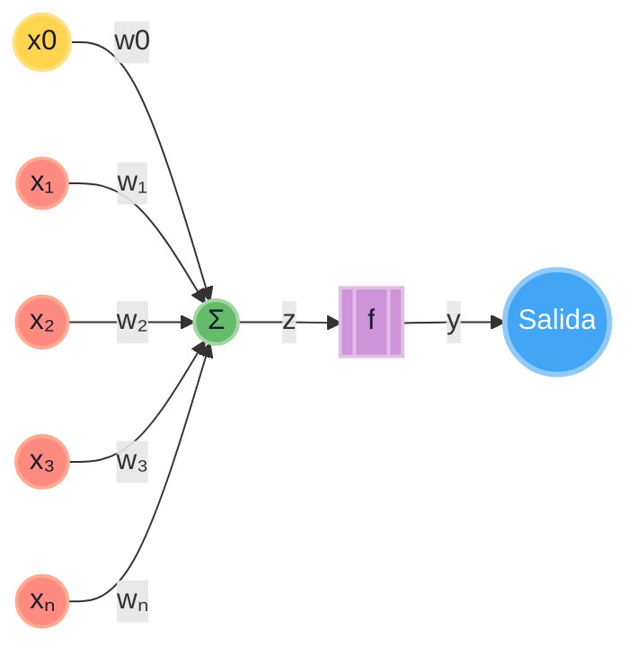

# Perceptrón simple (con el sesgo incluido como $x_0w_0$)

jflores

## perceptron


## 1. Arquitectura básica.

Para simplificar las matemáticas y la implementación, añadimos una entrada fija adicional $x_0 = 1$. Su peso correspondiente será $w_0$, que actuará como el **sesgo** (*bias*).

De esta forma, el perceptrón recibe **$n+1$ entradas**:

- $x_0 = 1$ (entrada constante)
- $x_1, x_2, \dots, x_n$ (entradas de los datos)

Y sus pesos correspondientes:

- $w_0 = b$ (el sesgo)
- $w_1, w_2, \dots, w_n$ (pesos de las características)

La suma ponderada (potencial de activación) se calcula como:

$$
z = \sum_{i=0}^{n} w_i x_i = w_0 \cdot 1 + \sum_{i=1}^{n} w_i x_i = b + \sum_{i=1}^{n} w_i x_i
$$

Luego, aplicamos la función de activación **escalón** (o *Heaviside*):

$
\hat{y} = 
\begin{cases} 
1 & \text{si } z \geq 0 \\
0 & \text{si } z < 0
\end{cases}
$

---

## 2. El error

Para ajustar los pesos, primero calculamos el **error** entre la salida deseada la etiqueta real ($y$) y la salida obtenida $(\hat{y}$):

$
e = y - \hat{y}
$

Los posibles valores del error son:

- **$e = 0$** → La predicción fue correcta.
- **$e = +1$** → $y = 1$ y $\hat{y} = 0$ (Falso negativo, la neurona no se activó cuando debía).
- **$e = -1$** → $y = 0$ y $\hat{y} = 1$ (Falso positivo, la neurona se activó cuando no debía).

---

## 3. La regla de actualización de pesos (Regla Delta unificada)

Ahora, **la misma fórmula** se aplica a **todos** los pesos, incluyendo el sesgo:

$$
\Delta w_i = \eta \cdot e \cdot x_i
$$

$$
w_i^{\text{nuevo}} = w_i^{\text{viejo}} + \Delta w_i
$$

Donde:
- **$\eta$** (eta) es la **tasa de aprendizaje**.
- **$e$** es el error calculado.
- **$x_i$** es el valor de la entrada i-ésima.

Observa que para $i = 0$, como $x_0 = 1$, la actualización del sesgo es:

$$
\Delta w_0 = \eta \cdot e \cdot 1 = \eta \cdot e
$$
$$
b^{\text{nuevo}} = b^{\text{viejo}} + \eta \cdot e
$$

Que es exactamente la misma regla que teníamos antes, pero ahora forma parte natural de la misma ecuación.

---

## 4. Lógica intuitiva del ajuste (caso por caso)

Vamos a ver qué hace esta fórmula en cada situación (suponiendo $\eta > 0$):

| Caso | $y$ | $\hat{y}$ | $e$ | Entrada $x_i$ | Efecto sobre $w_i$ |
| :--- | :--- | :--- | :--- | :--- | :--- |
| **Acierto** | 1 | 1 | 0 | Cualquiera | **No se modifica** ($\Delta = 0$) |
| **Acierto** | 0 | 0 | 0 | Cualquiera | **No se modifica** ($\Delta = 0$) |
| **Falso Negativo** | 1 | 0 | **+1** | $x_i$ positiva (+) | **Aumenta** el peso ($w_i$ sube) |
| **Falso Negativo** | 1 | 0 | **+1** | $x_i$ negativa (-) | **Disminuye** el peso ($w_i$ baja) |
| **Falso Negativo** | 1 | 0 | **+1** | $x_0 = 1$ (Sesgo) | **Aumenta** el sesgo ($w_0$ sube) |
| **Falso Positivo** | 0 | 1 | **-1** | $x_i$ positiva (+) | **Disminuye** el peso ($w_i$ baja) |
| **Falso Positivo** | 0 | 1 | **-1** | $x_i$ negativa (-) | **Aumenta** el peso ($w_i$ sube) |
| **Falso Positivo** | 0 | 1 | **-1** | $x_0 = 1$ (Sesgo) | **Disminuye** el sesgo ($w_0$ baja) |

> **En resumen:** Al incluir $x_0 = 1$, el sesgo se comporta exactamente igual que cualquier otro peso, pero como su entrada siempre es positiva, su ajuste solo depende del signo del error.

---

## 5. Algoritmo de entrenamiento completo (paso a paso)

1. Inicializar **todos** los pesos $w_0, w_1, \dots, w_n$ con valores pequeños aleatorios (ej. entre -0.5 y 0.5). Recuerda que $w_0$ es el sesgo.
2. Para cada muestra de entrenamiento $(x, y)$:
   - Asegurarte de que el vector de entrada incluya $x_0 = 1$: $x = [1, x_1, x_2, \dots, x_n]$.
   - Calcular la salida $\hat{y}$ (aplicar el escalón a $z = \sum w_i x_i$).
   - Calcular el error $e = y - \hat{y}$.
   - **Actualizar TODOS los pesos**: $w_i = w_i + \eta \cdot e \cdot x_i$ para $i = 0, 1, \dots, n$.
3. Repetir el paso 2 durante varias **épocas** hasta que todos los ejemplos se clasifiquen correctamente (error 0) o se alcance un número máximo de iteraciones.

## 6. Puntos clave y limitaciones

- **Convergencia**: El teorema de convergencia del perceptrón garantiza que **si los datos son linealmente separables**, el algoritmo encontrará una solución en un número finito de pasos.
- **Tasa de aprendizaje**: Si $\eta$ es muy grande, los pesos oscilarán y no convergerán. Si es muy pequeño, tardará mucho en aprender. Un valor típico es $\eta = 0.1$ o $0.01$.
- **Limitación**: Si los datos **no son linealmente separables** (ej. la función XOR), el perceptrón simple **nunca convergerá** y los pesos seguirán saltando sin encontrar una solución.


## Ejemplo en python
```python
import numpy as np

# --- Configuración del perceptrón ---
eta = 0.1                     # Tasa de aprendizaje
max_epochs = 10               # Máximo de épocas

# --- Datos de entrenamiento (puerta AND) ---
X_train = np.array([
    [0, 0],
    [0, 1],
    [1, 0],
    [1, 1]
])
y_train = np.array([0, 0, 0, 1])

# Número de características (sin contar el sesgo)
n_features = X_train.shape[1]

# 1. Inicializar TODOS los pesos (w_0, w_1, ..., w_n) con valores pequeños aleatorios entre -0.5 y 0.5.
#    El índice 0 es el sesgo (w_0), los demás son pesos de las características.
weights = np.random.uniform(-0.5, 0.5, size=n_features + 1)

# Función de activación escalón
def step_activation(z):
    return 1 if z >= 0 else 0

# Función para predecir una sola muestra (con sesgo incluido)
def predict(x):
    # Asegurar que x tenga el sesgo: [1, x1, x2, ...]
    x_with_bias = np.insert(x, 0, 1)
    z = np.dot(weights, x_with_bias)
    return step_activation(z)

# --- Entrenamiento ---
for epoch in range(max_epochs):
    total_errors = 0

    # 2. Para cada muestra de entrenamiento
    for xi, target in zip(X_train, y_train):
        # 2a. Asegurar que el vector de entrada incluya x_0 = 1
        x_with_bias = np.insert(xi, 0, 1)

        # 2b. Calcular la salida (suma ponderada + escalón)
        z = np.dot(weights, x_with_bias)
        y_hat = step_activation(z)

        # 2c. Calcular el error
        error = target - y_hat

        # 2d. Actualizar TODOS los pesos: w_i = w_i + eta * error * x_i
        weights = weights + eta * error * x_with_bias

        # Acumular el error absoluto para saber si hay fallos
        total_errors += abs(error)

    # Si el error total es 0, todos los ejemplos se clasificaron correctamente
    if total_errors == 0:
        print(f"Convergencia alcanzada en la época {epoch + 1}")
        break

print(f"Entrenamiento finalizado. Pesos finales: {weights}")

# --- Prueba de predicciones ---
print("\n--- Predicciones finales ---")
for xi in X_train:
    pred = predict(xi)
    print(f"Entrada: {xi} -> Predicción: {pred}")
```

Ejemplo en JS
```js
class Perceptron {
  constructor(nEntradas, tasaAprendizaje = 0.1) {
    this.pesos = new Array(nEntradas).fill(0);
    this.bias = 0;
    this.tasaAprendizaje = tasaAprendizaje;
  }

  activacion(z) {
    return z >= 0 ? 1 : 0;
  }

  predecir(x) {
    const z = x.reduce((suma, xi, i) => suma + xi * this.pesos[i], 0) + this.bias;
    return this.activacion(z);
  }

  entrenar(X, y, epocas = 10) {
    for (let e = 0; e < epocas; e++) {
      for (let i = 0; i < X.length; i++) {
        const xi = X[i];
        const yi = y[i];
        const prediccion = this.predecir(xi);
        const error = yi - prediccion;

        // Actualizamos pesos y bias
        this.pesos = this.pesos.map((w, j) => w + this.tasaAprendizaje * error * xi[j]);
        this.bias += this.tasaAprendizaje * error;
      }
    }
  }
}

// Datos de entrenamiento: función lógica AND
const X = [[0,0], [0,1], [1,0], [1,1]];
const y = [0, 0, 0, 1];

const p = new Perceptron(2);
p.entrenar(X, y, 10);

X.forEach(xi => {
  console.log(`Entrada: [${xi}] -> Predicción: ${p.predecir(xi)}`);
});

console.log("Pesos finales:", p.pesos);
console.log("Bias final:", p.bias);
```
---


# La regla delta

## perceptron simple


$$\Delta w_i = \eta \cdot (y- \hat{y}) \cdot x_i$$
Donde
* $\Delta w_i$ = cambio en el peso $w_i$
* $\eta$ = tasa de aprendizaje
* $y$ = salida deseada (0,1)
* $\hat{y}$ = salida predicha
* $x_i$ = entrada i

Problema: solo funciona para datos linealmente separables y los cambios son bruscos (no graduales).

## Regla delta generalizada

La regla delta generaliza el aprendizaje usando el error cuadratico medio y permite ajustes proporcionales al error, lo que la hace mas suave y aplicable a funciones continuas.

1. Función de activación continua, en lugar de la función escalón. Se usa una función diferenciable como *sigmoid*e o *tangente hiperbólica*. **Usemos sigmoide**:

$$f(z) = \frac{1}{1+e^{-z}}$$

Esto permite calcular derivadas y aplcar gradiente

2. definición del error

para una muestra $(x, y)$ el error se define como:

$$E = \frac{1}{2} \cdot (y- \hat{y})^2$$

donde $\hat{y} = f(w \cdot x)$ es la salida de la red.

3. Actualización de pesos por descenso de gradiente.

La regla delta ajusta los pesos en la dirección que reduce el error, moviendose en sentido contrario al gradiente.

$$\Delta w_i = \eta \cdot \frac{\partial E}{\partial w_i}$$

Aplicando la regla de la cadena

$$\frac{\partial E}{\partial w_i}$$

Si esta derivada es positiva significa que al aumentar el peso, el error aumenta (vamos mal). Si es negativa, al aumentar el peso, el error disminuye (vamos bien). por eso la usamos para actualizar el peso.

Aplicando la regla de la cadena: esta dice que si una variable depende de otra, y esa otra depende de una tercera, para encontrar la derivada total **multiplicamos las derivadas parciales de cada eslabón**

En nuestro caso, la cadena de dependencias es:

$$w_i \rightarrow z \rightarrow \hat{y} \rightarrow E$$

Es decir
* Cambio en $w_i \implies afecta \, a \, z$ 
* Cambio en $z \implies afecta \, a \, \hat{y} \,(por que \, \hat{y} = f(z))$ 
* Cambio en  $\hat{y} \, afecta \, al \, error \, E$

Para calcular $\frac{\partial E}{\partial w_i}$, multiplicamos las derivadas de cada uno de estos tres eslabones

$$\frac{\partial E}{\partial w_i} = \frac{\partial E}{\partial \hat{y}} \cdot \frac{\partial \hat{y}}{\partial z} \cdot \frac{\partial z}{ \partial w_i}$$

Calculado estos 3 terminos por separado:

Primer eslabon $\frac{\partial E}{\partial \hat{y}}$ (como cambia el error cuando cambia la predicción)

como $E = \frac{1}{2} \cdot (y-\hat{y}) ^ 2$ derivamos respecto a $\hat{y}$.

$$\frac{\partial E}{\partial \hat{y}} = \frac{1}{2} \cdot 2 \cdot (y-\hat{y}) \cdot (-1) = -(y-\hat{y})= \hat{y}-y$$

>Nota: a veces veras que lo ponen como $(y-\hat{y})$ con signo negativo dependiendo de como definan el error, pero el resultado final de la formula con que empezamos es $(y-\hat{y})$

Segundo eslabón $\frac{\partial \hat{y}}{\partial z}$ (como cambia la predicción cuando cambia la suma ponderada)

Esto es simplemente la derivada de la función de activación $f(z)$

$$\frac{\partial \hat{y}}{\partial z} = f'(z)$$

Tercer eslabón: $\frac{\partial z}{\partial w_i}$ (como cambia la suma ponderada cuando cambia un peso específico).

Recuerda que $z = (w_1 \cdot x_1 + w_2 \cdot x_2 \cdots + b)$

Si derivamos $z$  respecto a $w_i$ todos los terminos se vuelven 0 excepto el que contiene a $w_i$:

 $\frac{\partial z}{\partial w_i} = x_i$

Multimplicamos los tres eslabones:

$$\frac{\partial E}{\partial w_i} = - (y-\hat{y}) \cdot f'(z) \cdot x_i$$

Y por que la formula de actualización no tiene signo negativo?

$$\Delta w_i = \eta \cdot (y-\hat{y}) \cdot f'(z) \cdot x_i$$

donde fue a parar el signo menos:

En el algoritmo de descenso de gradiente, la regla de actualización siempre resta el gradiente (la derivada) del peso actual, para ir "cuesta abajo" y minimizar el error.

$$w_{nuevo} = w_{viejo} - \eta \cdot \frac{\partial E}{\partial w_i}$$

sustituimos la derivada que tenia signo menos

$$w_{nuevo} = w_{viejo} - \eta [-(y-\hat{y}) \cdot f'(z) \cdot  x_i]$$

al multiplicar el signo menos de la formula de actualización por el signo menos de la derivada estos se cancelan y obtenemos la regla delta:
$$w_{nuevo} = w_{viejo}+ \eta \cdot (y-\hat{y}) \cdot f'(z) \cdot x_i$$

por eso $\Delta w_i$ (lo que se suma al peso viejo) es directamente:

$$\Delta w_i = \eta \cdot (y-\hat{y}) \cdot f'(z) \cdot x_i$$


Donde:
* $\eta$ es la tasa de aprendizaje.
* $(y-\hat{y})$ es el error de salida.
* $f'(z)$ es la derivada de la función de activación.
* $x_i$ es la entrada i.


Entrada: conjunto de entrenamiento ${(x^{k}, t^{k})}$, tasa de aprendizaje η, épocas
```
Inicializar w y b con valores pequeños aleatorios

para cada época:
    error_total = 0
    para cada patrón (x, t):
        # Propagación hacia adelante
        z = w·x + b
        y = f(z)                     # sigmoide, por ejemplo

        # Cálculo del error
        error = t - y
        error_total += error^2

        # Regla delta (gradiente)
        delta = error * f'(z)        # = error * y*(1-y) si f=sigmoide

        # Actualización de pesos
        w = w + η * delta * x
        b = b + η * delta

    si error_total < tolerancia:
        detener
```

```python
import numpy as np

def sigmoid(z):
    return 1 / (1 + np.exp(-z))

def perceptron_delta(X, t, eta=0.1, epochs=1000):
    n_samples, n_features = X.shape
    w = np.random.randn(n_features) * 0.01
    b = 0.0

    for epoch in range(epochs):
        error_total = 0
        for x_i, t_i in zip(X, t):
            z = np.dot(w, x_i) + b
            y = sigmoid(z)

            error = t_i - y
            delta = error * y * (1 - y)   # regla delta con derivada de sigmoide

            w += eta * delta * x_i
            b += eta * delta

            error_total += error**2

        if epoch % 100 == 0:
            print(f"Época {epoch}, error: {error_total:.4f}")

    return w, b
```