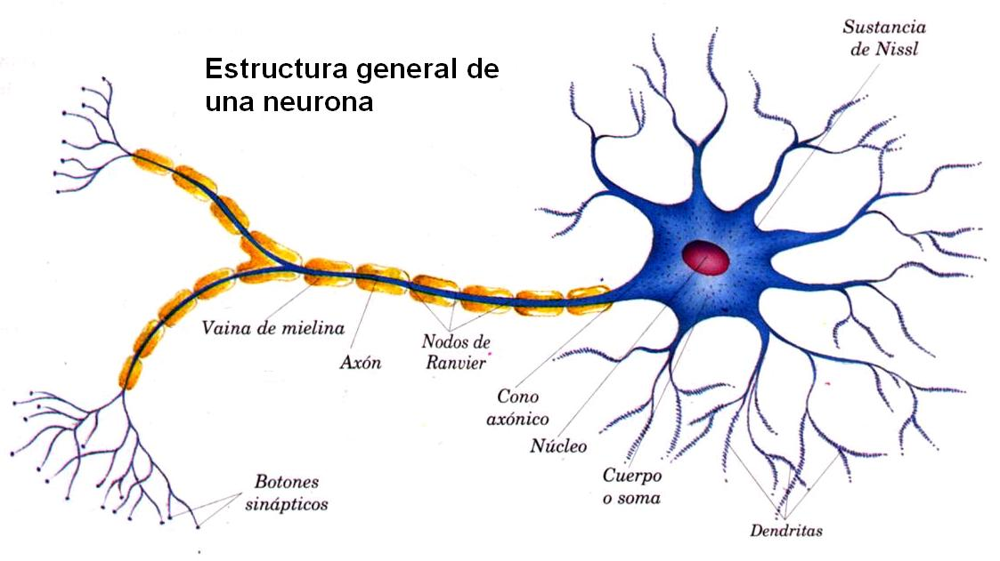
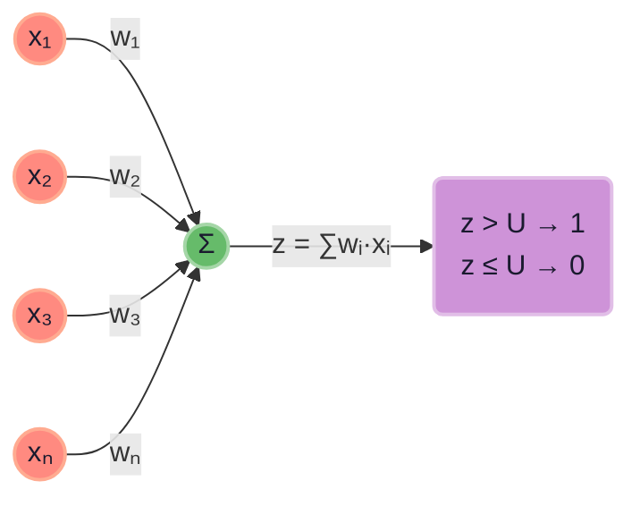
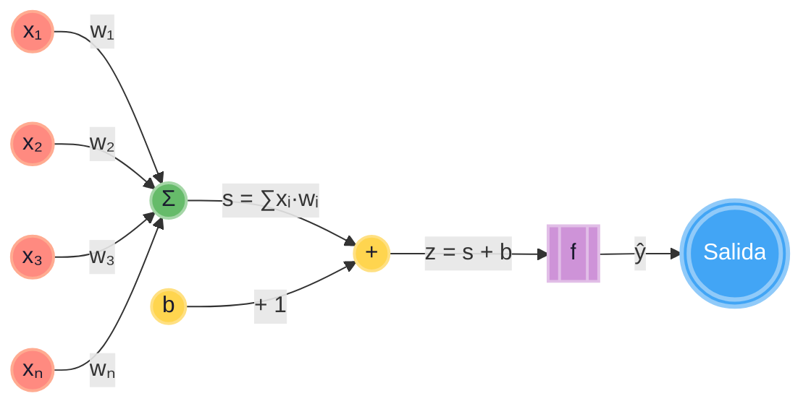

# perceptron simple

jflores

## Perceptron

El perceptrón es el modelo más simple de una neurona artificial. Fue propuesto por Frank Rosenblatt en 1958 y es la base de las redes neuronales modernas. Es como una "neurona" que toma varias entradas, las combina, y decide si "se activa" o no.

## Introducción
### Recta

Recordemos la ecuación de la recta que usaremos mas adelante. 
Ecuación de la recta

$$w_1x_1 + w_2x_2 + ... + w_nx_n + b = 0$$

por ejemplo para $R^2$

$$w_1x_1 + b = 0$$

Donde 
$w_1$ es la pendiente de la recta.
$b$ es el cruce de la recta con el eje de las ordenadas.

Recta

### Neurona

1. La Anatomía de una neurona

Componentes principales:
* Las Dendritas (Las Antenas): Son ramificaciones que actúan como canales de entrada. Su única función es recibir señales químicas o estímulos de otras neuronas.
* El Soma o Cuerpo Celular (El Procesador): Es el centro de la neurona. Aquí se reúne toda la información recibida por las dendritas, se pondera (se atenua o amplifica cada señal)  y se toma una decisión matemática/química: ¿el mensaje es lo suficientemente fuerte como para transmitirlo o no?
* El Axón (El Cable de Salida): Es una prolongación larga por la que viaja el impulso eléctrico si el soma decide que el mensaje debe continuar. Al final del axón están los terminales (botones sinapticos) que se conectan con la siguiente neurona.

2. El Proceso Dinámico: ¿Cómo viaja la información?

El funcionamiento se explica mediante un ciclo eléctrico y químico llamado sinapsis:[Señales de entrada] ➔ (Dendritas) ➔ [Soma: Suma de impulsos ponderados] ➔ (Axón) ➔ [Sinapsis] ➔ [Siguiente neurona]

* Recepción: Las dendritas reciben sustancias químicas (neurotransmisores) de neuronas vecinas. Estas sustancias alteran la carga eléctrica interna de la neurona.
* Potencial de Acción (El interruptor del Todo o Nada): La neurona no transmite "mensajes a medias". Si la suma de la energía eléctrica acumulada en el soma supera un límite específico (**umbral**), se dispara un chispazo eléctrico llamado potencial de acción. Si no llega al umbral, no pasa nada.
* Transmisión (La Sinapsis): El impulso eléctrico recorre todo el axón hasta el extremo final. Al llegar ahí, la electricidad provoca la liberación de nuevos neurotransmisores al espacio libre que hay entre neuronas (espacio sináptico). Esos químicos flotan hasta tocar las dendritas de la siguiente neurona, reiniciando el ciclo.

La neurona aprende cuando sabe que ponderación debe dar a cada señal de entrada.

### Neurona Artificial

Una neurona artificial es la unidad fundamental de procesamiento en las redes neuronales artificiales. Está inspirada en el funcionamiento de las neuronas biológicas, pero es un modelo matemático simplificado que procesa información numérica.

Una sola neurona artificial se ve así:

---

La nuerona recibe **entradas** $x_i$, cada una multiplicada por un **peso** $w_i$ (esto es la ponderación), y suma todo:

$
z = \sum_{i=1}^{n} w_i x_i  
$

* Si $z > U$ la neurona se activa
* Si $z <= U$ la neurona NO se activa

### Perceptron

si tomamos $b=-U$

* Si $∑wi·xᵢ + b > 0$ la neurona se activa
* Si $∑wᵢ·xᵢ + b <= 0$ la neurona NO se activa

La neurona 
Luego, aplica la función de activación **escalón** (o *Heaviside*):

$
\hat{y} = 
\begin{cases} 
1 & \text{si } z \geq 0 \\
0 & \text{si } z < 0
\end{cases}
$

Es decir, si la suma ponderada supera el umbral, la neurona se "activa" (clase 1); si no, permanece inactiva (clase 0).

---

### Aprendizaje (el manejo del error)

Para que la neurona aprenda, debemos ajustar los pesos $w_i$. Para ajustar los pesos (para que la neurona aprenda), primero calculamos el **error** entre la salida deseada la etiqueta real $ y $ y la salida obtenida $\hat{y}$:

$
e = y - \hat{y}
$

Los posibles valores del error son:

- **\( e = 0 \)** → La predicción fue correcta.
- **\( e = +1 \)** → \( y = 1 \) y $\hat{y} = 0$ (Falso negativo, la neurona no se activó cuando debía).
- **\( e = -1 \)** → \( y = 0 \) y $\hat{y} = 1$ (Falso positivo, la neurona se activó cuando no debía).

---

### La regla de actualización de pesos (Regla Delta)

La fórmula para actualizar cada peso $ w_i $ en el perceptrón es:

$
\Delta w_i = \eta \cdot e \cdot x_i
$

$
w_i^{\text{nuevo}} = w_i^{\text{viejo}} + \Delta w_i
$

Y para el **sesgo** (que actúa como un peso especial con entrada fija \( +1 \)):

$
\Delta b = \eta \cdot e
$

$
b^{\text{nuevo}} = b^{\text{viejo}} + \Delta b
$

Donde:
- **$\eta$** (eta) es la **tasa de aprendizaje** (un valor pequeño, ej. 0.1).
- **$e$** es el error calculado.
- **$x_i$** es el valor de la entrada i-ésima.

---

## Lógica intuitiva del ajuste (caso por caso)

Fórmula en cada situación (suponiendo \( \eta > 0 \)):

| Caso | $y$ | $\hat{y}$ | $e$ | Entrada $x_i$ | Efecto sobre $w_i$ |
| :--- | :--- | :--- | :--- | :--- | :--- |
| **Acierto** | 1 | 1 | 0 | Cualquiera | **No se modifica** ($\Delta = 0$) |
| **Acierto** | 0 | 0 | 0 | Cualquiera | **No se modifica** ($\Delta = 0$) |
| **Falso Negativo** | 1 | 0 | **+1** | $x_i$ positiva (+) | **Aumenta** el peso (para que la próxima vez sume más y se active) |
| **Falso Negativo** | 1 | 0 | **+1** | $x_i$ negativa (-) | **Disminuye** el peso (para que no reste tanto y se active) |
| **Falso Positivo** | 0 | 1 | **-1** | $x_i$ positiva (+) | **Disminuye** el peso (para que la próxima vez sume menos y no se active) |
| **Falso Positivo** | 0 | 1 | **-1** | $x_i$ negativa (-) | **Aumenta** el peso (para que reste más y no se active) |

> **En resumen:** El perceptrón mueve los pesos en la **dirección** que reduce el error. Si se activó cuando no debía, los reduce; si no se activó cuando debía, los aumenta.

---

### Algoritmo de entrenamiento completo (paso a paso)

1. Inicializar todos los pesos $w_i$ y el sesgo $b$ con valores pequeños aleatorios (ej. entre -0.5 y 0.5).
2. Para cada muestra de entrenamiento $(x, y)$:
   - Calcular la salida $\hat{y}$ (aplicar el escalón a $\sum_{i=1}^{n} w_i x_i  $).
   - Calcular el error $e = y - \hat{y}$.
   - **Actualizar pesos**: $w_i = w_i + \eta \cdot e \cdot x_i$
   - **Actualizar sesgo**: $b = b + \eta \cdot e$
3. Repetir el paso 2 durante varias **épocas** (iteraciones completas sobre el conjunto de datos) hasta que todos los ejemplos se clasifiquen correctamente (error 0) o se alcance un número máximo de iteraciones.

---

### Puntos clave y limitaciones

- **Convergencia**: El teorema de convergencia del perceptrón garantiza que **si los datos son linealmente separables**, el algoritmo encontrará una solución en un número finito de pasos.
- **Tasa de aprendizaje**: Si $\eta$ es muy grande, los pesos oscilarán y no convergerán. Si es muy pequeño, tardará mucho en aprender. Un valor típico es $\eta = 0.1$ o $0.01$.
- **Limitación**: Si los datos **no son linealmente separables** (ej. la función XOR), el perceptrón simple **nunca convergerá** y los pesos seguirán saltando sin encontrar una solución.

---

