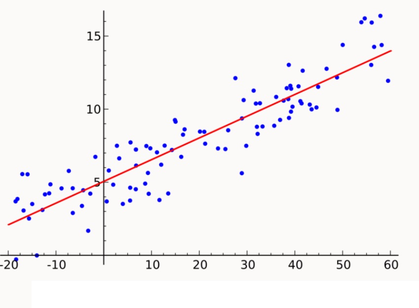

# regresión líneal

La regresión lineal es un modelo matemático que describe la relación entre varias variables. Los modelos de regresión lineal son un procedimiento estadístico que ayuda a predecir el futuro. Se utiliza en los campos científicos y en los negocios, y en las últimas décadas se ha utilizado en el aprendizaje automático.

La tarea de la regresión en el aprendizaje automático consiste en predecir un parámetro (Y) a partir de un parámetro conocido (X).

## regresión líneal simple

En una regresión lineal, se trata de establecer una relación entre una variable independiente y su correspondiente variable dependiente. Esta relación se expresa como una línea recta. No es posible trazar una línea recta que pase por todos los puntos de un gráfico si estos se encuentran ordenados de manera caótica. Por lo tanto, sólo se determina la ubicación óptima de esta línea mediante una regresión lineal. Algunos puntos seguirán distanciados de la recta, pero esta distancia debe ser mínima. El cálculo de la distancia mínima de la recta a cada punto se denomina función de pérdida.

La ecuación de una línea recta tiene la siguiente forma:

Y = β₀ + β₁X + ε,

donde:

Y es la variable independiente.
β₀ y β₁ son dos constantes desconocidas que representan el punto de intersección y la pendiente respectivamente.
ε (epsilon) es la función de pérdida.

A continuación se muestra un ejemplo gráfico de un modelo de una regresión lineal simple:

