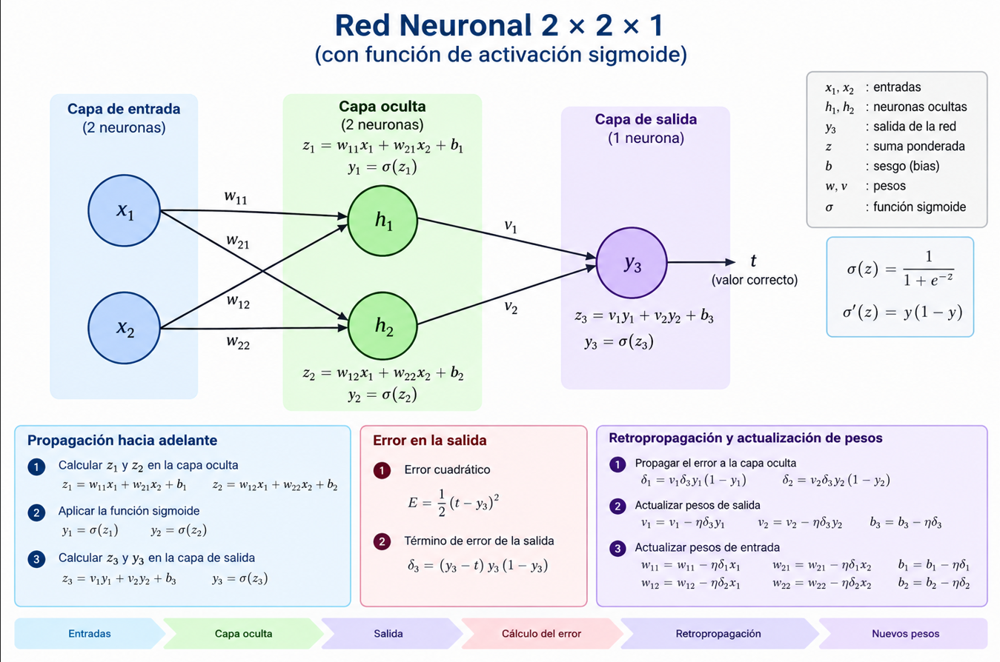

# Retropropagación en una red neuronal 2×2×1



La retropropagación consiste en **calcular cuánto contribuyó cada peso al error de salida** y después ajustar esos pesos para reducir el error.

## 1. Estructura de la red

La red tiene:

- **2 entradas:** \(x_1\) y \(x_2\)
- **2 neuronas en la capa oculta**
- **1 neurona en la capa de salida**
- **Función de activación sigmoide**

Para evitar confusiones, usaremos:

- \(z\): valor antes de aplicar la activación
- \(y\): salida calculada por la red
- \(t\): valor correcto o esperado

La función sigmoide es:

\[
\sigma(z)=\frac{1}{1+e^{-z}}
\]

Su derivada es:

\[
\sigma'(z)=y(1-y)
\]

## 2. Propagación hacia adelante

### Primera capa
La primera capa solo recibe los datos de entrada: $x_1, x_2$

### Segunda capa (capa oculta)
#### Primera neurona oculta

\[
z_1=w_{11}x_1+w_{21}x_2+b_1
\]

Salida primera neurona oculta (aplicando funcion de activación [sigmoide])
\[
y_1=\sigma(z_1)
\]

#### Segunda neurona oculta

\[
z_2=w_{12}x_1+w_{22}x_2+b_2
\]
Salida segunda neurona oculta (aplicando funcion de activación [sigmoide])
\[
y_2=\sigma(z_2)
\]

### Capa de salida

#### Unica Neurona de salida

\[
z_3=v_1y_1+v_2y_2+b_3
\]

Salida de la red
\[
y_3=\sigma(z_3)
\]

En este caso:

- \(y_3\) es la predicción de la red.
- \(t\) es el valor correcto.

## 3. Calcular el error

Usando el error cuadrático:

\[
E=\frac{1}{2}(t-y_3)^2
\]

El objetivo es modificar los pesos para que \(y_3\) se acerque a \(t\).

## 4. Calcular el error de la salida

El error de salida se calcula comparando lo que la red predijo con el valor correcto.

Usaremos:

* $y_3$ : salida de la red
* $t$: valor correcto
* $E$ : error
* $δ_3$ : error que se utiliza para ajustar los pesos

Primero calculamos el error cuadratico

$$E = \frac{1}{2} \cdot (t-y_3)^2$$

recordemos que $y_3 = sigmoide(z_3)$:
$$y3​=σ(z3​)$$

entonces:
$$\delta_3 = \frac{\partial E}{\partial z_3} = \frac{\partial E}{\partial y_3} \frac{\partial y_3}{\partial z_3}$$

Primera derovada:
 $$\delta_3 = \frac{\partial E}{\partial z_3} = \frac{\partial E}{\partial y_3} \frac{\partial y_3}{\partial z_3}$$

Derivndo respecto a $y_3$
$$\frac{∂E}{​∂y_3}​=y_3​−t$$
Segunda derivada:
$$y3​=σ(z3​)$$

la derivada de la sigmoide es:
\[
\sigma'(z_3)=y_3(1-y_3)
\]
o sea
$$\frac{∂y_3}{​∂z_3}​​=y3​(1−y3​)$$

Por tanto multiplicando ambas derivadas:


\[
\boxed{\delta_3=(y_3-t)y_3(1-y_3)}
\]

Este valor indica la dirección y la magnitud del ajuste necesario en la neurona de salida.

## 5. Actualizar los pesos de salida

Si \(\eta\) representa la tasa de aprendizaje:

\[
\frac{\partial E}{\partial v_1}=\delta_3y_1
\]

\[
\frac{\partial E}{\partial v_2}=\delta_3y_2
\]

Los nuevos pesos son:

\[
v_1^{nuevo}=v_1-\eta\delta_3y_1
\]

\[
v_2^{nuevo}=v_2-\eta\delta_3y_2
\]

El sesgo de salida se actualiza mediante:

\[
b_3^{nuevo}=b_3-\eta\delta_3
\]

## 6. Propagar el error hacia la capa oculta

La primera neurona oculta recibe parte del error a través del peso \(v_1\):

\[
\delta_1=v_1\delta_3\sigma'(z_1)
\]

Como:

\[
\sigma'(z_1)=y_1(1-y_1)
\]

obtenemos:

\[
\boxed{\delta_1=v_1\delta_3y_1(1-y_1)}
\]

La segunda neurona oculta recibe parte del error a través del peso \(v_2\):

\[
\delta_2=v_2\delta_3\sigma'(z_2)
\]

Por tanto:

\[
\boxed{\delta_2=v_2\delta_3y_2(1-y_2)}
\]

## 7. Actualizar los pesos de entrada

Para la primera neurona oculta:

\[
w_{11}^{nuevo}=w_{11}-\eta\delta_1x_1
\]

\[
w_{21}^{nuevo}=w_{21}-\eta\delta_1x_2
\]

\[
b_1^{nuevo}=b_1-\eta\delta_1
\]

Para la segunda neurona oculta:

\[
w_{12}^{nuevo}=w_{12}-\eta\delta_2x_1
\]

\[
w_{22}^{nuevo}=w_{22}-\eta\delta_2x_2
\]

\[
b_2^{nuevo}=b_2-\eta\delta_2
\]

## 8. Ejemplo numérico

Supongamos que la red produce:

\[
y_3=0.7
\]

y el valor correcto es:

\[
t=1
\]

El error cuadrático es:

\[
E=\frac{1}{2}(1-0.7)^2
\]

\[
\boxed{E=0.045}
\]

Ahora calculamos el término de error de la salida:

\[
\delta_3=(0.7-1)(0.7)(1-0.7)
\]

\[
\delta_3=(-0.3)(0.7)(0.3)
\]

\[
\boxed{\delta_3=-0.063}
\]

Como el término de error es negativo, la red debe aumentar su salida.

Si:

\[
\eta=0.1
\]

y:

\[
y_1=0.6
\]

entonces el ajuste del peso \(v_1\) es:

\[
v_1^{nuevo}=v_1-0.1(-0.063)(0.6)
\]

\[
\boxed{v_1^{nuevo}=v_1+0.00378}
\]

El peso \(v_1\) aumenta ligeramente para ayudar a que la salida se acerque al valor correcto.

## 9. Resumen del proceso

```text
Entradas
   ↓
Calcular z1 y z2 en la capa oculta
   ↓
Aplicar la función sigmoide
   ↓
Calcular z3 y y3 en la capa de salida
   ↓
Comparar y3 con el valor correcto t
   ↓
Calcular el error δ3 de la salida
   ↓
Actualizar los pesos de salida
   ↓
Calcular δ1 y δ2 en la capa oculta
   ↓
Actualizar los pesos de entrada
   ↓
Repetir con más ejemplos